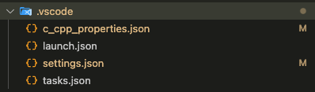

## Safetics WebAssemble Complie Project (For SFD)

* [EMSDK](https://github.com/emscripten-core/emsdk)를 이용하여 WebAssembly 빌드를 하기위한 프로젝트 Cmake Build
* [Next.js](https://nextjs.org)기반의 Safetics Designer 3D 웹 서비스를 보다 최적화 하기위한 web assembly를 사용하는 수단으로서 만들어진 프로젝트
* 각각의 wasm파일을 [Next.js](https://nextjs.org)의 public 폴더에 이관후 Iterator를 사용하여 함수를 정렬한 후 사용할 예정

### Current state of projects

* 2024/05/30 프로젝트 환경 구성중

### VSCode Set-up(for MacOS)

